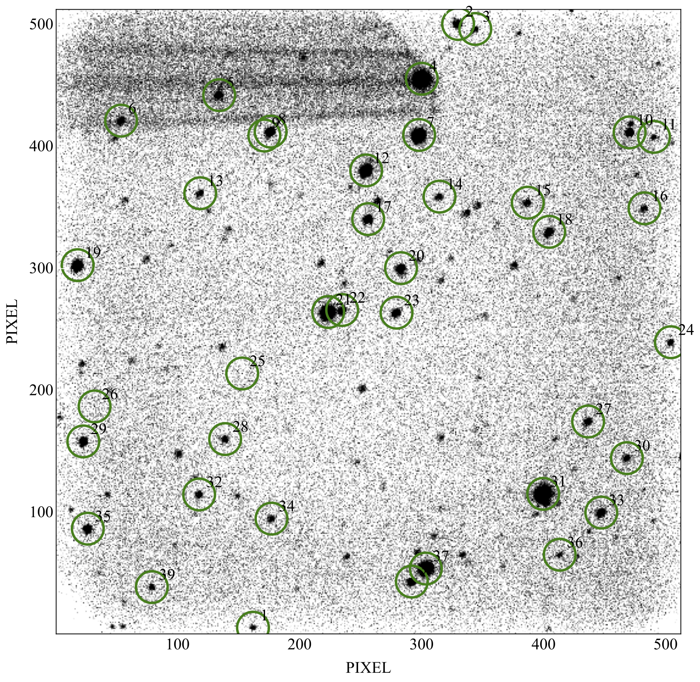

OPTICAM 
======
Suite of software to prepare and analyse data from OPTICAM


## Prerequisites
    - numpy
    - pandas
    - matplotlib
    - astropy
    - astroalign
    - aplpy
    - synphot
    - lmfit
    - yaml

You also need a working version of SExtractor in your machine to perform the aperture photometry.

##  Section 1:  Exposure Time Calculator
This package is used to calculate an exposure time based on a desired signal to noise ratio for OPTICAM `<https://www.southampton.ac.uk/opticam/>`. This code has been modified and adapted specifically for OPTICAM: The original code can be downloaded here: `here <https://apoexposuretimecalculator.github.io/APOExptime/>`.

Import the four distinct objects inside OPTICAM:

```python
from opticam import Sky, Target, Instrument, Observation
```

### Sky
First, let's create the <strong>Sky</strong> conditions, where lunar phase can go from 0 (New moon) to 1 (Full moon). Seeing is in arcseconds:
```python
sky = Sky(lunar_phase=0.5, seeing=1.5)
```

### Target
Then, let's create our <strong>Target</strong> Object. First entry is the target's magnitude, second entry is a string that specifies the magnitude system of the input magnitude [vegamag/stmag/abmag], third entry is the band pass for entered magnitude (only Johnson filters are supported at the moment). Default object is a blackbody spectrum with a solar temperature T=5778 K. You can choose between a blackbody, a powerlaw F<sub>&lambda;</sub>&Proportional;&lambda;<sup>-index</sup>
```python
#BlackBody T=5000 K
star1 = Target(16.5, 'VEGAMAG', 'V', temp=5000)			
# PowerLaw F<sub>&lambda;</sub>, index = -4
star2 = Target(20.1, 'stmag', 'B', index=4)				
```

You can also upload a custom SED
```python
import numpy as np

# custom_sed.txt has two columns: 1) Wavelenght [AA]; 2) Flux [erg/s/cm^2/AA]
custom_sed = np.loadtxt('custom_sed.txt')				
star3 = Target(13.8, 'abmag', 'B', sed=custom_sed)	
```

### Instrument
Now, let's load the instrument. Only Opticam is supported at the moment.
```python
inst = Instrument('Opticam')
```

### Observation
We can now combine all three objects to generate and observation.
```python
obs = Observation(star, sky, inst)
```
Now, we can use this object to generate either the SNR for a given exposure time or viceversa:
```python
snr_1 = obs.SNfromTime(200) #value in seconds
time_1 = obs.TimefromSN(50) #value in S/N ratio

print(snr_1)
print(time_1)
```
This will generate for every filter in OPTICam the desired SNR (assuming a unique exposure time for all filters), or the exposure time required in each filter to achieve the desired SNR.
```
[[35.7873250731623, 'uprime_filter'], [141.40232164373245, 'gprime_filter'], [182.41241192694474, 'rprime_filter'], [183.60018496695776, 'iprime_filter'], [114.7288335187604, 'zprime_filter']]

[[387.1788766085068, 'uprime_filter'], [25.201236621119214, 'gprime_filter'], [15.179251054637014, 'rprime_filter'], [14.98133450353503, 'iprime_filter'], [38.189538299358965, 'zprime_filter']]
```

###  Plotting
A more convenient way of using this calculator is to export the information as a plot. 
```python
from opticam import makeplots

ob3 = Observation(star, sky, inst)
# 10 second integrations
ob3.SNfromTime(10)   					

# 'SN', will create a SNR plot for the 10 sec exposures
dd = makeplots(ob3, 'SN')				
```
<p align="middle">
 
</p>

```python
ob4 = Observation(star, sky, inst)
# SNR = 50
ob4.TimefromSN(50)

# 'Time', will create a Exposure time plot for SNR=50
dd = makeplots(ob4, 'Time')					
											
```
<p align="middle">
 
</p>

### Limitations
------------
This package is  only for the 2.1m telescope at the Observatorio Astronomico Nacional.
The current supported instruments are: OPTICam

## Section 2 - Quick Aperture Photometry
You need to set the all the raw/reduced files in a folder (e.g., 'bl_cam') inside your working directory (e.g., './'). Since we will extract a single camera at a time, 

```python
import opticam

datadir = 'bl_cam/'
catdir = 'bl_cam_cat/'
name = 'BL_Cam_r'                   
```
Then import the <strong>Reduction</strong> object and set all the keywords. You need to do the reduction one camera at a time! Here you can select the images for the camera 2 --> 'C2'.

```python
op = opticam.Reduction(rawdata=datadir,savedir=catdir,
                        name=name,rule='C2*.fits')
op.sextractor()         # Perform aperture photometry
op.creat_ref_list()     # Make master star list & FoV image
op.photometry()         # Cross-match between all images
```
After using SExtractor to create all the catalogues, the program will create a master list (e.g., 'BL_Cam_r_ref_stars.csv') with unique identifiers for all the stars in the field (based on the first image, it can be defined as well).  You can check the id of the target of interest in a image (as seen below) of the field with all the id numbers of the stars. In this case BL Cam has the identifier 21.
In the end, the 'op.photometry' will create a singel 'csv' and 'pkl' file, containing all the photometry from all the stars. 
<p align="middle">
 
</p>

After checking the number for our target, we can recover the differential photomety for this particular target.
```python
target = 21

photo = opticam.Analysis(catalogue=catdir,name=name)
photo.differential_photo(target=target,ignore=None)
photo.rms_mag(target=target)
photo.lightcurve(std=True)
photo.ccd_noise()
```
These commands will produce a final file with the photometry for this target; 'BL_Cam_r_lc_21.csv'. It will also output plots of the light curve:
<p align="middle">
 
</p>
as well as diagnostic plots:
<p align="middle">
 
  
</p>